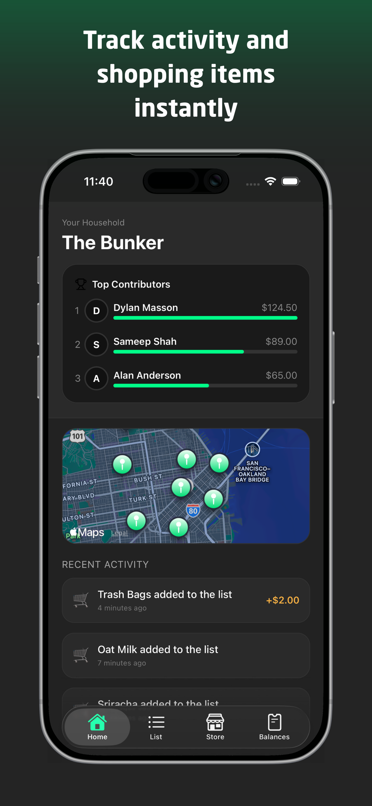
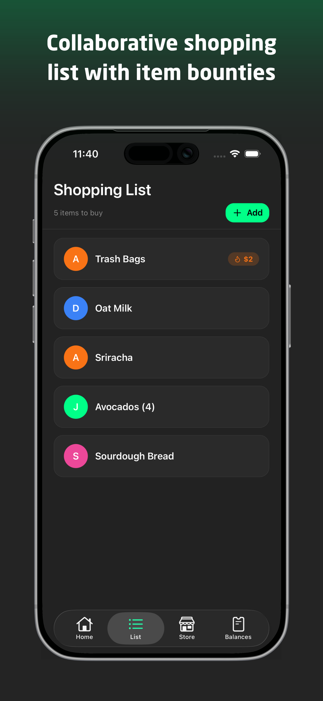
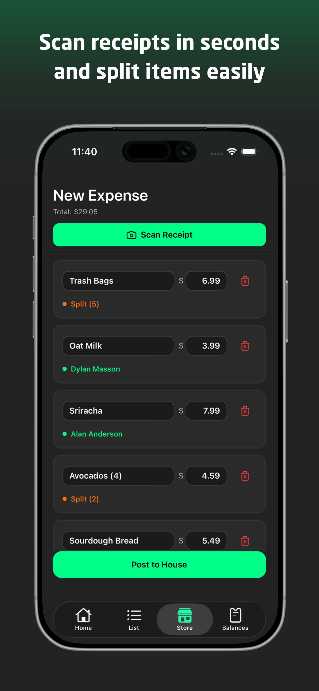
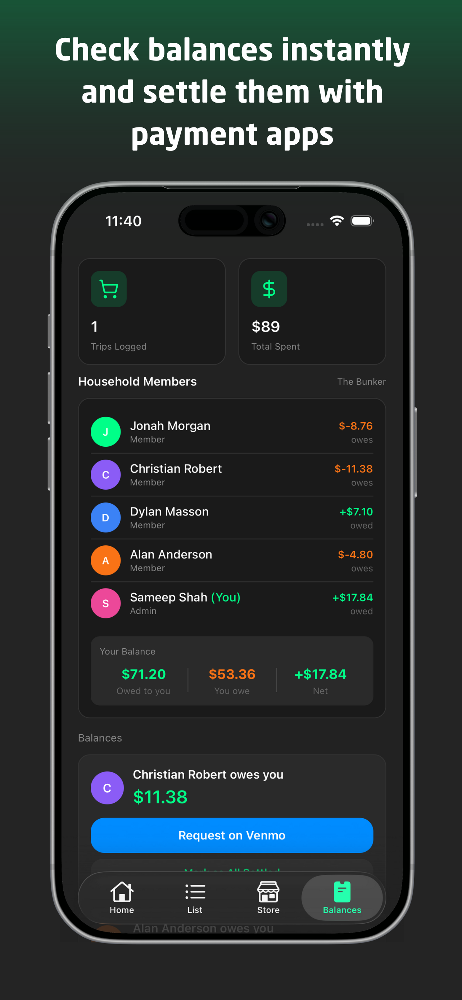

# Sidequest 🛒📍

**The Ultimate Roommate Grocery App**

Transform your household chores into a game. Sidequest helps roommates coordinate grocery runs, split costs fairly, and never forget an item again.

---

## 📸 Screenshots

| Home & Bounties | Smart Scanning | Transactions | Profile |
|:---:|:---:|:---:|:---:|
|  |  |  |  |

---

## 🚀 Features

### 📍 Location-Based Bounties
- **Geofencing**: Never walk past a grocery store without knowing what your household needs. Sidequest notifies you when you are near a store with active "bounties".
- **Real-time Alerts**: Uses `expo-location` to trigger notifications when you enter a defined region.

### 🧾 Magic Receipt Scanning
- **Native Intelligence**: Uses Apple's **Vision Framework** to recognize text and on-device **Language Models** to intelligently structure the data.
- **Smart Splitting**: Automatically identifies store names, items, and prices without sending images to the cloud.
- **Thick Client Logic**: Calculates tax, tip ratios, and item assignment locally before sending data to the server.

### 💰 Fair Expense Splitting
- **Debt Ledger**: Keeps track of who owes whom.
- **Easy Settlement**: Settle debts with a tap (Venmo integration context).

### 🏆 Gamified Shopping
- **Bounties**: Earn extra credit for picking up items on the list.
- **Leaderboard**: See who contributes the most to the household.

---

## 🏗️ Architecture:

We perform significant logic on the device to minimize latency and improve privacy.
- **OCR & Parsing**: Happens entirely on-device using Apple Vision Framework and local LLMs.
- **Split Calculations**: Tax and tip distribution logic runs locally.
- **Search**: Uses a custom Expo Module to bridge Apple's `MKLocalSearch` for free location search, avoiding Google Places API costs.

---

## 🛠️ Tech Stack

### Core
- **Framework**: React Native (Expo SDK 50+)
- **Language**: TypeScript (Strict Mode)
- **Navigation**: Expo Router (File-based routing)

### Backend & Data
- **Backend Service**: Supabase (Auth, Database, Realtime)
- **Database**: PostgreSQL
- **State Management**: Zustand
- **Querying**: `@supabase/supabase-js`

### UI & Styling
- **Styling**: NativeWind (Tailwind CSS) & `StyleSheet`
- **Icons**: Lucide React Native & `@expo/vector-icons`
- **Maps**: `react-native-maps` (Apple Maps on iOS)

### Critical Libraries
- `expo-location`: For geofencing and location tracking.
- `expo-apple-authentication`: Native Sign in with Apple.
- **Custom Native Module**: Uses `Vision` and `FoundationModels` (on-device LLMs) for zero-latency, private receipt parsing.

---

## 📡 Database Schema

The app uses a relational schema on Supabase:

- **Users**: Linked to Supabase Auth, stores Venmo handles.
- **Shopping Items**: Tracks items, bounties, and purchase status.
- **Transactions**: Records payments and receipt images.
- **Debt Ledger**: Manages IOUs between roommates.
